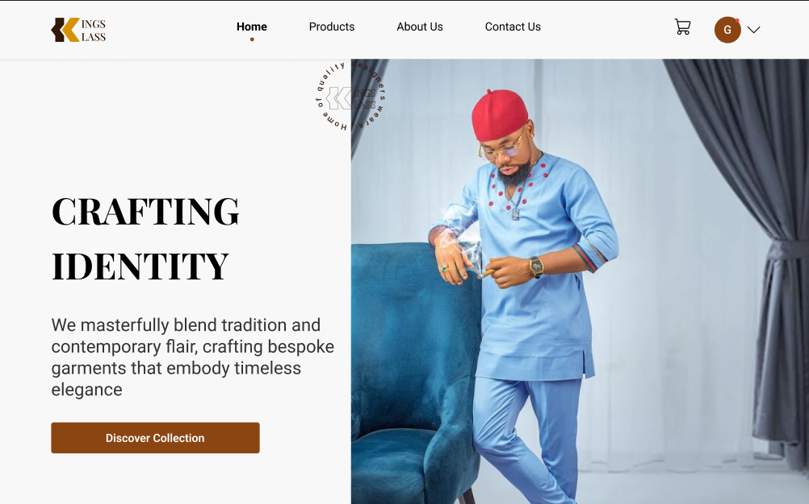
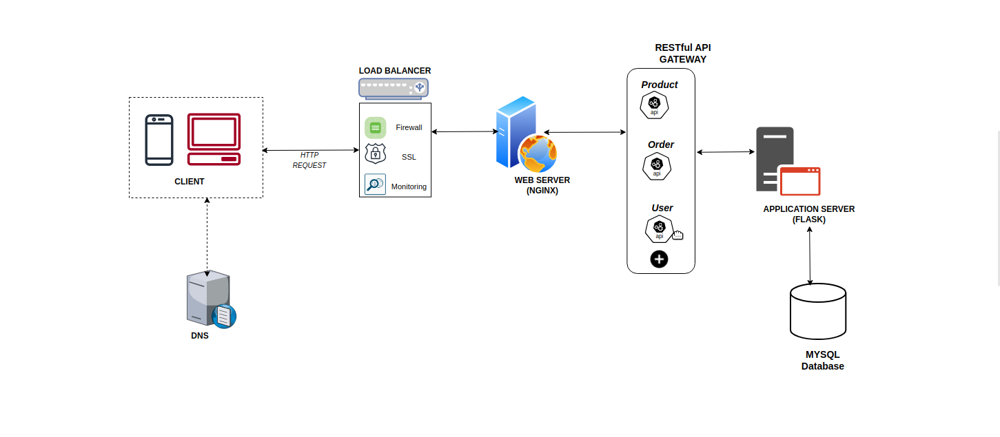
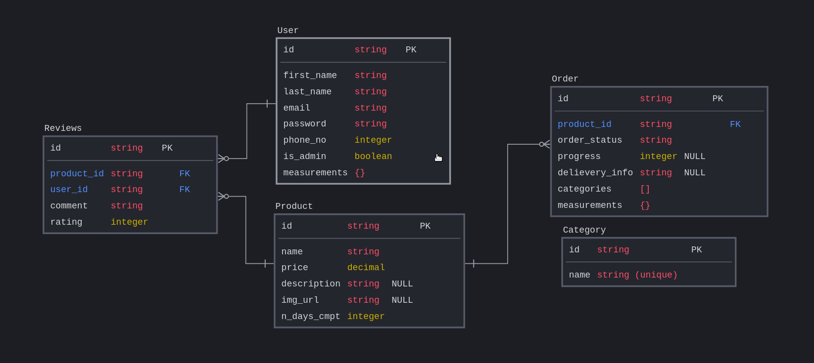

# Kingsklass Designs - (backend)

This project aims to complement the traditional tailoring experience by developing an innovative online platform for `KingsKlass Designs`. Despite thriving in traditional tailoring, `KingsKlass Design` faces the need for an enhanced online presence to connect with a wider audience. This is a backend implementation of Kingsklass web application



## Building Kingsklass

- ### Why ?
    I've always relied on KingsKlass, a reliable tailor, for all of my clothing needs. However, it has become a difficult experience since I relocated, and my tailor was no longer able to provide me with the same level of service because of the distance.

- ### The Problem
    - it was difficult to get my measurements
    - there was no direct contact about how the work was going.
    - KingsKlass Designs is doing well in traditional, in-person tailoring, but it needs to have a stronger online presence to reach a wider audience. This would allow him to:

    - showcase prior work, products, and brands
    - show reviews of prior work to confirm proficiency and delivery
    - easily submit measurements online, streamlining the order placement process
and even more...

- To bridge this gap, this is a backend implementation of a web application tailored to solve these specific problems


- ### Process
    - The process started with an approved [project proposal](https://docs.google.com/document/d/1-GHArXvp4vsgwjb_FGhZ3McNep2pXZbQjnkRGu_078U/edit?addon_store#heading=h.nvkg307j7abm). We collaborated closely with our client, Kingsklass, to ensure alignment with his business needs. The aim is to deliver tangible value to their enterprise, not just a digital solution.

    - Next, we defined the [MVP specifications](https://docs.google.com/document/d/1YHhEOlDOi-20tpNmZ_R_JI1Yd61saBanqWRtnh4Ryno/edit?addon_store#heading=h.c1xhe1boyaf7) and presented it as a set of tasks on a Trello board


## Web Infastructure

We employed a straightforward web infrastructure, with separate development and deployment for the frontend and backend. Communication between them occurs via REST API endpoints.

- Backend techs/tools used
        `- Flask && Gunicorn
        - Python
        - MYSQL
        - SQLAlchemy
        - Nginx web server`

- Frontend techs/tools used:
        - `ReactJS`


## Model design, DB Storage &  Datagram
Given the unique nature of the tailoring business domain, we dedicated time to come up with a simple model design and a decoupled database storage mechanism (MYSQL).  This separation allows for greater flexibility and scalability of the application. Simply put,  our application interacts with the database through an intermediate layer (class), rather than directly accessing the database.

```bash
BaseModel - # base class
        |--   Product
        | --  Order
        | --  User
        | --- Reviews
        | --- Category


DBStorage - # storage engine
    # methos and attrs
    |-- get
    |-- reload
    |-- delete
    etc
    .
    .
```

</img>


## API Documentation


`POST <domain-name>/register` - Create a new user (requires json object: email and password)

`POST <domain-name>/login` - Authenticate an existing user


- prefix - `<domain-name>/api/v1/`

- ### Product
    - `GET /products`: Retrieve a list of all products
    - `GET /products/<id>`: Retrieve details of a specific product by ID
    - `POST /products`: Create a new product.
    - `PUT /products/<id>`: Update an existing product by ID. 
    - `DELETE /products/<id>`: Delete a product by ID.

- ### Order
    - `GET /orders`: Retrieve a list of all orders.
    - `GET /order/<id>`: Retrieve details of a specific order by ID.
    - `PUT /order/<id>`: Update an existing order by ID.
    - `GET /orders/<order_id>/measurements`

- ### Category
    - `GET /categories`: Retrieve a list of all categories.
    - `POST /categories/<category_name>`: Create a new category
    - `DELETE /categories/<category_name>`: Create or DELETE a category
    - `GET /category/<category_id>/products`: Get a list of products belonging to this category

- ### User
    - `GET /users:` Retrieve a list of all users.
    - `POST <domain-name>/register:` Create a new user
    - `POST <domain-name>/login:` Authenticate a new user
    - `GET /users/<user_id>/:` Get a specific user by ID
    - `GET /users/<user_id>/orders:` Retrieve all orders made by from a user by ID.
    - `GET /users/<user_id>/orders:` Create a new order for this user
    - `GET /users/<user_id>/orders/<order_id>:` Retrieve a specific order by ID from a sp`ecific user by ID.
    - `GET /users/<user_id>/measurements`: Retrieve measurement data for this user

- ### Review
    - `GET /products/<product_id>/reviews`: Retrieve a list of all reviews for this product of ID
    - `POST /products/<product_id>/reviews`: Create a new review for a specific product
    - `GET /reviews/<review_id>/product`: Get the product for this review
    - `GET | POST| PUT /reviews/<review_id>`: Retrieve, create or update a review


## Authentication & Authorization
Communication between the client and backend service occurs via REST API endpoints. Authentication is implemented using JSON Web Tokens (JWT), and endpoints are secured for admin-only resources


## Test
A Comprehensive unit tests have been implemented for all components of the application, covering the model, API, and storage engine. Each component is tested independently to ensure its functionality and integrity. All tests are located in the `/test` folder


## Contribution

Contributions are welcome! If you find any issues or have suggestions for improvements, feel free to open an issue or submit a pull request